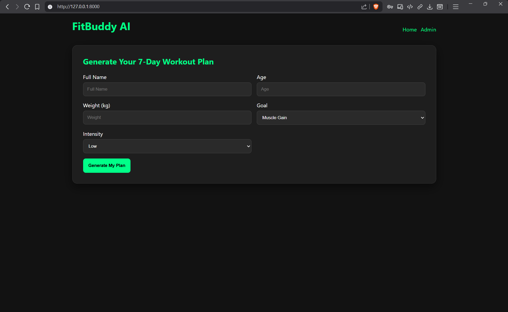
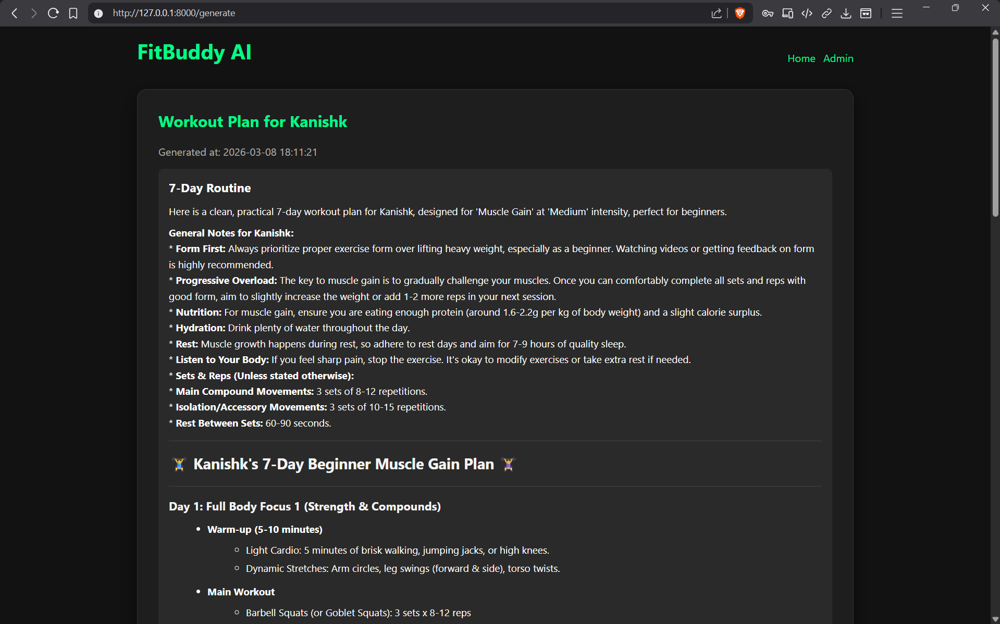
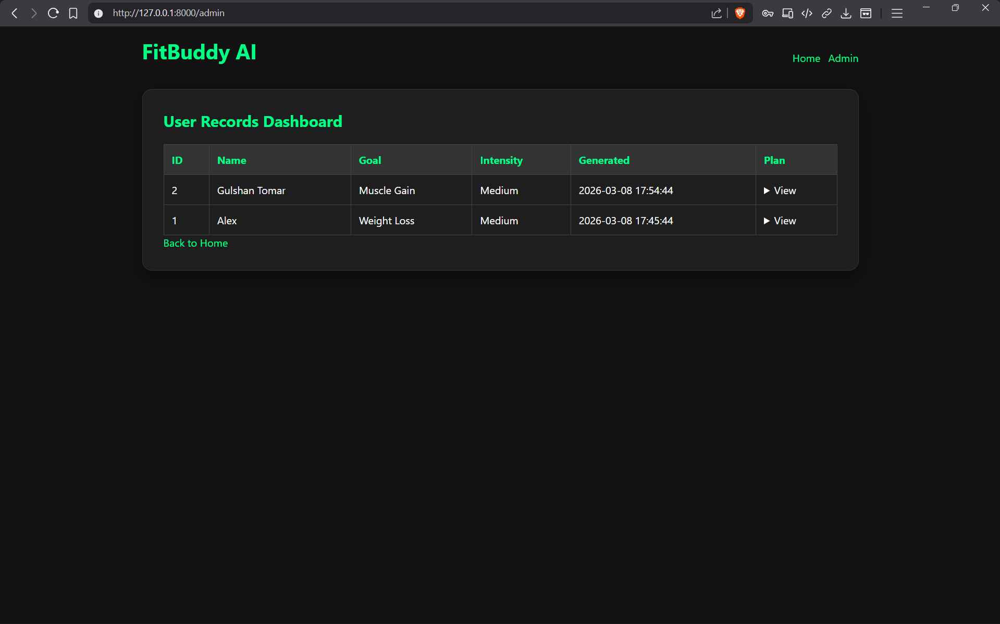

# 💪 FitBuddy — AI-Powered Personalized Workout Planner

Generate personalized 7-day workout plans using Google Gemini AI.

FitBuddy is a full-stack web app that generates personalized 7-day workout plans using Google Gemini.
Users can submit their fitness profile, view a clean formatted plan, refine it with natural-language feedback, and get practical nutrition/recovery tips.

---

## 🎥 Demo

Watch the project demo:

https://drive.google.com/drive/folders/1I1uUMuv-s2ah17im-AKbEWtrQkrpFgu5

This video demonstrates:

- Entering user fitness profile
- AI workout plan generation
- Feedback-based plan updates
- Admin dashboard

---

## Features

- **AI Workout Plan Generation** - Creates a structured 7-day plan based on name, goal, and intensity.
- **Feedback-Based Plan Update** - User feedback is used to regenerate and improve the plan.
- **Nutrition / Recovery Tip** - Quick goal-specific tip is shown with every plan.
- **Persistent Storage** - Plans are saved in local SQLite using SQLAlchemy.
- **Simple Beginner Architecture** - Flat Python structure with only 3 backend files.

---

## 📸 Screenshots

### Home Page



### Generated Workout Plan



### Admin Dashboard



---

## Tech Stack

| Layer | Technology |
|-------|------------|
| Backend | FastAPI (Python 3.10+) |
| AI | Google Gemini API (`google-genai`) |
| Database | SQLite + SQLAlchemy ORM |
| Frontend | Jinja2 templates + custom CSS/JS |
| Config | `python-dotenv` |

---

## 🏗 System Architecture

The application follows a layered architecture:

```text
User Browser
   ↓
Frontend (HTML + Jinja2)
   ↓
FastAPI Backend
   ↓
AI Service (Google Gemini)
   ↓
SQLite Database
```

---

## Project Structure

```text
fitbuddy/
|-- requirements.txt
|-- README.md
|-- .gitignore
|-- .env                      # local only, not committed
|-- fitbuddy.db               # auto-created SQLite DB
|-- docs/
|   |-- architecture.png      # add exported architecture diagram
|   |-- screenshots/
|       |-- .gitkeep
|       |-- home.png          # add screenshot
|       |-- result.png        # add screenshot
|       |-- admin.png         # add screenshot
|
|-- app/
|   |-- __init__.py
|   |-- main.py               # routes + app setup
|   |-- db.py                 # SQLAlchemy model + DB session helpers
|   |-- ai.py                 # Gemini + nutrition tip + markdown sanitizer
|
|-- templates/
|   |-- base.html
|   |-- index.html
|   |-- result.html
|   |-- all_users.html
|
|-- static/
|   |-- css/
|   |   |-- style.css
|   |-- js/
|       |-- app.js
```

---

## Getting Started

### Prerequisites

- Python 3.10+
- A Google Gemini API key

### 1. Clone the Repository

```bash
git clone <your-repo-url>
cd fitbuddy
```

### 2. Create Virtual Environment

```bash
python -m venv venv
```

### 3. Activate Virtual Environment (Windows)

```bash
venv\Scripts\activate
```

### 4. Install Dependencies

```bash
pip install -r requirements.txt
```

### 5. Configure `.env`

Create a `.env` file in the project root:

```env
GOOGLE_API_KEY=your_actual_gemini_api_key_here
```

### 6. Run the App

```bash
uvicorn app.main:app --reload
```

### 7. Open in Browser

Go to: `http://127.0.0.1:8000`

---

## API Endpoints

### `GET /`
Shows the input form (`index.html`).

### `POST /generate`
Generates and saves a new workout plan.

Form fields:

```text
name=Alex&age=23&weight=68.5&goal=Weight Loss&intensity=Medium
```

### `POST /submit-feedback`
Updates an existing plan using user feedback.

Form fields:

```text
user_id=1&feedback=Add more cardio and reduce leg volume
```

### `GET /admin`
Shows all saved users and plans (`all_users.html`).

### `GET /health`
Simple health check response.

---

## Example API Request

Generate a workout plan:

`POST /generate`

Example form body:

```text
name=Alex
age=23
weight=68
goal=Weight Loss
intensity=Medium
```

---

## Database Schema

### `users`

| Column | Type | Description |
|--------|------|-------------|
| `id` | Integer | Primary key |
| `name` | String | User name |
| `age` | Integer | User age |
| `weight` | Float | Weight in kg |
| `goal` | String | Fitness goal |
| `intensity` | String | Workout intensity |
| `original_plan` | Text | Initial generated plan |
| `updated_plan` | Text (nullable) | Feedback-updated plan |
| `generated_at` | DateTime | Record timestamp |

---

## How It Works

```text
index.html --POST /generate--> app/main.py
                                |
                                |-- generate_workout_plan()  -> app/ai.py (Gemini)
                                |-- quick_nutrition_tip()    -> app/ai.py (local tip)
                                |-- save UserRecord          -> app/db.py (SQLite)
                                v
                             result.html

result.html --POST /submit-feedback--> app/main.py
                                       |
                                       |-- update_workout_plan() -> app/ai.py (Gemini)
                                       |-- update UserRecord      -> app/db.py
                                       v
                                    result.html (updated)

/admin --> reads all users from SQLite --> all_users.html
```

---

## Module Responsibilities

| Module | Responsibility |
|--------|----------------|
| `app/main.py` | FastAPI app setup + all HTTP routes |
| `app/db.py` | SQLAlchemy engine, model, and DB session helpers |
| `app/ai.py` | Gemini generation, feedback updates, nutrition tips, markdown sanitizing |

---

## Environment Variables

| Variable | Required | Description |
|----------|----------|-------------|
| `GOOGLE_API_KEY` | Yes | Gemini API key |

---

## Limitations

- Depends on external Gemini API availability
- No user authentication system yet
- Workout plans are text-based only
- No long-term progress tracking

---

## License

This project is created for academic and educational purposes.

---
